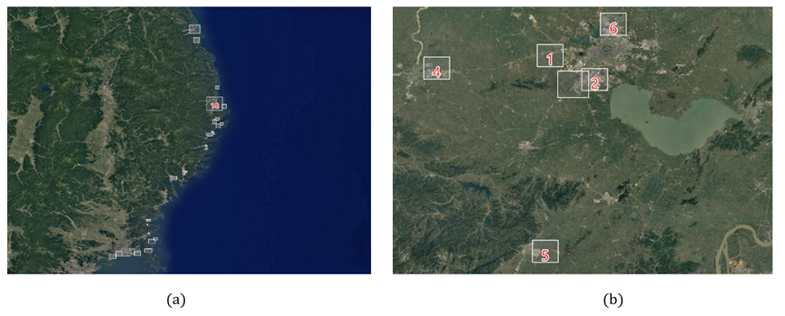
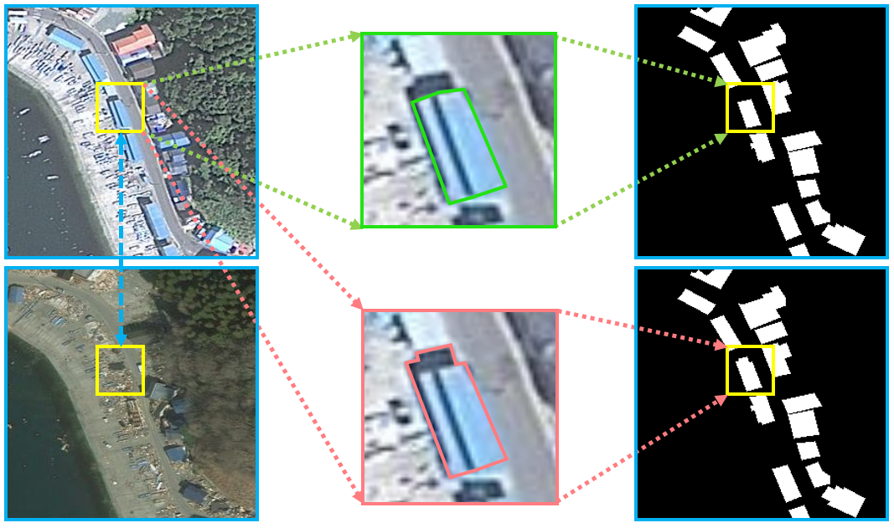
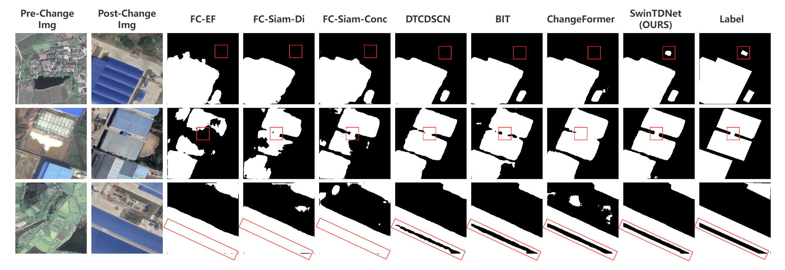
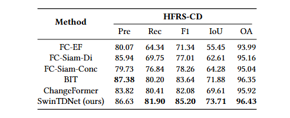

# HFRS-CD
# Description
  Our work proposes a remote sensing image change detection dataset focusing on building changes (HFRS-CD). All the original data is obtained from Google Earth. It is mainly about the destruction of buildings after the earthquake and tsunami and the increase of buildings in the suburbs of the city.
  The dataset is of the same size as other public datasets in the field, containing 11348 (256×256) pixel image pairs, while its (512×512) pixel version contains 2837 image pairs, of which 960 are of buildings destroyed in more than 20 coastal areas by the tsunami caused by the March 11, 2011 earthquake in Japan. The corresponding data collection area is shown in Figure1 (a). The remaining 1877 pairs are the building changes in Hefei and surrounding cities and other six regions over a period of 5-15 years, and the corresponding data collection is shown in Figure1 (b). At the same time, when labeling the data set, we did not label the shadow parts of some houses in Figure2, and slightly labeled the edges of the buildings, so that the changed and unchanged parts had a more accurate distinction.

Figure 1: The original region where our dataset was collected.

Figure 2: Examples of correct annotations for shaded buildings in our dataset, with the green flow for correct annotations (our annotations) and the red flow for incorrect annotations (shaded parts of buildings).

# Experimental results on our dataset.
Figure 3: Visual comparison on the HFRS-CD dataset. The parts marked in the red boxes show that our method achieves more efficient detection results than other methods.

Table 1: Comparison results on HFRS-CD dataset. The highest scores are highlighted in bold.All scores are described as percentages (%).

# Download

We will make our dataset public later.  lllll
<!-- [Baidu](https://pan.baidu.com/s/1A0PRx--25aI8ulT1hX4njQ)   -->

