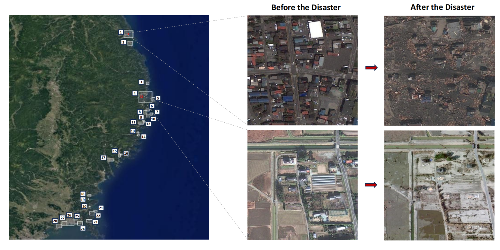
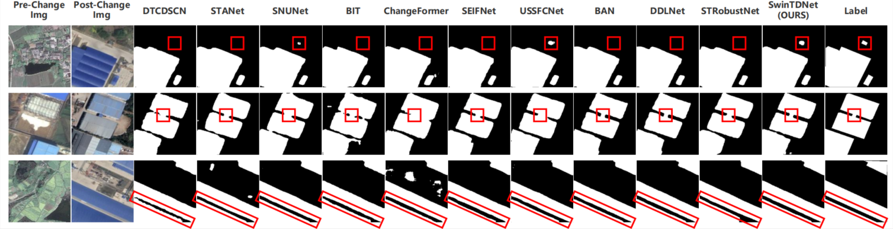
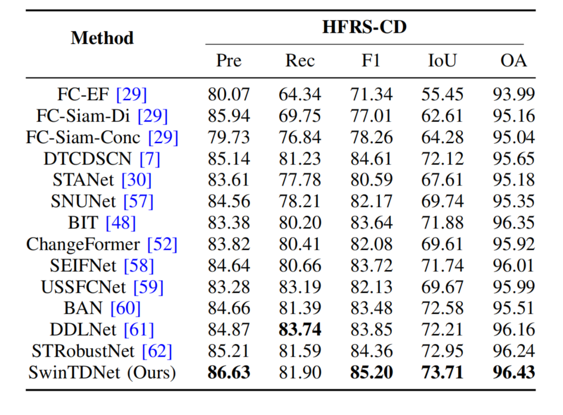

# HFRS-CD
# Description
  The HFRS-CD dataset focuses on the relatively scarce domain of building damage assessment before and after major natural disasters. To construct this dataset, we systematically investigated significant global natural disasters that occurred over the past 15 years. Based on the timing of these events, we retrieved and screened high-resolution remote sensing imagery corresponding to the affected areas. Ultimately, we selected the coastal regions impacted by the Great East Japan Earthquake and Tsunami on March 11, 2011, as the primary focus of this dataset. Fig. 1 illustrates the 28 representative regions we collected, along with two examples of zoomed-in image patches. The spatial extent of each region was carefully defined to ensure full coverage of damaged buildings, and the number of image patches within each region varies accordingly. Through image comparison and manual inspection, we confirmed that these 28 regions comprehensively cover the major coastal areas affected by the disaster.

Figure 1: For the selection of the research area of post-disaster building changes, we chose the coastal areas where buildings were damaged by the dual major natural disasters of the East Japan Earthquake and Tsunami on March 11, 2011. This figure shows the location and size of the 28 areas we collected, and we also show two pairs of enlarged area image examples. Our collection covers almost all coastal buildings affected by this disaster.

  

Figure 2: Examples of correct annotations for shaded buildings in our dataset, with the green flow for correct annotations (our annotations) and the red flow for incorrect annotations (shaded parts of buildings).

  

# Experimental results on HFRS-CD dataset.
Figure 3: Visual comparison on the HFRS-CD dataset. The parts marked in the red boxes show that our method achieves more efficient detection results than other methods.

  

Table 1: Comparison results on HFRS-CD dataset. The highest scores are highlighted in bold.

  

# Download

We will make our dataset public later. 
<!-- [Baidu](https://pan.baidu.com/s/1A0PRx--25aI8ulT1hX4njQ)   -->

